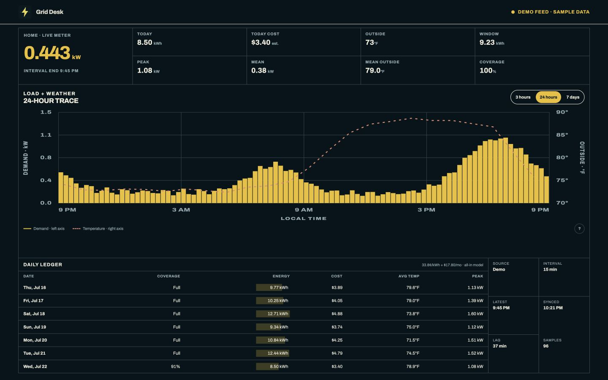
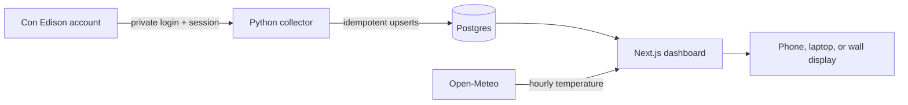

<div align="center">
  
  <h1>Grid Desk</h1>
  <p><strong>Your home's electricity, rendered like an instrument panel.</strong></p>
  <p>Near-real-time Con Edison demand, historical energy, estimated cost, and local weather in one dense, responsive dashboard.</p>
</div>



Grid Desk turns the interval data already available in a Con Edison account into a dashboard that is useful at a glance. It polls privately, stores real readings in Postgres, backfills available history, and makes the difference between utility lag and a broken collector explicit. It works on a phone, a laptop, or a small always-on display.

> **Reality check:** this is near-real-time, not a physical smart-meter stream. Con Edison normally publishes 15-minute intervals after an additional utility-side delay. Grid Desk shows the latest interval and measured lag instead of presenting delayed data as instantaneous.

## Why it is interesting

- **Live-feeling, honest data:** automatic refresh with the source interval, sync time, and publication delay always visible.
- **Three time scales:** switch among the last 3 hours, 24 hours, and 7 days without leaving the main view.
- **Energy and demand:** see both kWh consumed and average kW during every source interval.
- **Weather context:** compare demand with outdoor temperature from Open-Meteo using your own city-level coordinates.
- **Cost context:** a configurable all-in residential estimate translates energy into dollars.
- **Durable collection:** encrypted session persistence, refresh-on-auth-failure, idempotent upserts, and historical backfill survive restarts without duplicating readings.
- **Private by construction:** utility credentials and session cookies stay in the collector; the browser only receives normalized readings.

## Try the interface in one command

You need [Git](https://git-scm.com/) and [Docker Desktop](https://www.docker.com/products/docker-desktop/).

```bash
git clone https://github.com/sidhanthp/grid-desk.git
cd grid-desk
docker compose up --build
```

Open [http://localhost:3000](http://localhost:3000). With no utility credentials, Grid Desk deliberately starts with synthetic **demo-mode** readings. Demo data never enters production ingestion or masquerades as Con Edison data.

If port 3000 is already in use, start with `WEB_PORT=3100 docker compose up --build` and open that port instead.

Stop it with `Ctrl+C`; remove the local database later with `docker compose down --volumes`.

## Connect your own Con Edison account

1. Copy the safe template:

   ```bash
   cp .env.example .env
   ```

2. Add your Con Edison login to `.env`. Never commit this file.

   ```dotenv
   CONED_EMAIL=you@example.com
   CONED_PASSWORD=your-password
   ```

3. Generate two unrelated secrets and paste their values into `.env`:

   ```bash
   # INGEST_TOKEN
   openssl rand -hex 32

   # SESSION_ENCRYPTION_KEY (builds the collector image if needed)
   docker compose run --rm collector \
     python -c 'from cryptography.fernet import Fernet; print(Fernet.generate_key().decode())'
   ```

   ```dotenv
   INGEST_TOKEN=first-generated-value
   SESSION_ENCRYPTION_KEY=second-generated-value
   ```

4. Optionally set city-level coordinates for weather. Leaving them blank uses central New York City and does not affect electricity collection.

   ```dotenv
   WEATHER_LATITUDE=40.7128
   WEATHER_LONGITUDE=-74.0060
   ```

5. Start the stack:

   ```bash
   docker compose up --build
   ```

6. Watch the collector status at [http://localhost:8001/health](http://localhost:8001/health). If Con Edison requests MFA, wait for a new code and submit it without echoing or saving the code:

   ```bash
   ./scripts/submit-mfa.sh
   ```

   The script prompts invisibly for `INGEST_TOKEN` and the current six-digit code. Grid Desk encrypts the resulting cookie jar in Postgres and tries the saved session before requesting MFA again. If you already use a TOTP authenticator, `CONED_TOTP_SECRET` can complete challenges automatically; treat that seed like a password.

Once authenticated, the collector loads recent 15-minute readings and backfills the hourly history Con Edison currently exposes. Refresh the dashboard after the first successful sync. Accounts with more than one active electric service may also need `CONED_ACCOUNT_URN` in `.env`.

## How it works



| Part | Responsibility | Can access utility credentials? |
|---|---|---:|
| `services/collector` | Login, token refresh, polling, backfill, encrypted session persistence | Yes |
| Postgres | Normalized readings, sync runs, encrypted session state | No plaintext credentials |
| `apps/web` | Read-only dashboard, weather proxy, demo mode | No |
| Browser | Charts and normalized API responses | No |

The browser-facing reading shape is intentionally small:

```json
{
  "mode": "live",
  "latestReadingAt": "2026-07-22T14:15:00.000Z",
  "lastSyncedAt": "2026-07-22T15:02:11.000Z",
  "readings": [
    {
      "startsAt": "2026-07-22T14:00:00.000Z",
      "endsAt": "2026-07-22T14:15:00.000Z",
      "averageKw": 0.428,
      "kwh": 0.107
    }
  ]
}
```

## Configuration

| Variable | Service | Required for live data | Purpose |
|---|---|---:|---|
| `DATABASE_URL` | collector + web | Yes | Postgres connection; Docker Compose supplies this locally |
| `DATABASE_SSL` | web | No | Set to `disable` only for a trusted local database without TLS; Compose does this locally |
| `CONED_EMAIL` | collector | Yes | Con Edison login |
| `CONED_PASSWORD` | collector | Yes | Con Edison login |
| `SESSION_ENCRYPTION_KEY` | collector | Recommended | Encrypts persisted session cookies |
| `INGEST_TOKEN` | collector | Required for manual MFA | Protects `/auth/mfa` |
| `CONED_TOTP_SECRET` | collector | No | Optional automatic TOTP MFA |
| `CONED_ACCOUNT_URN` | collector | Sometimes | Selects an account with multiple electric services |
| `WEATHER_LATITUDE` / `WEATHER_LONGITUDE` | web | No | Weather location; prefer city-level coordinates for privacy |
| `ENERGY_RATE_PER_KWH` | web | No | Variable all-in rate estimate in dollars; default `0.338` |
| `MONTHLY_FIXED_CHARGE` | web | No | Fixed monthly charge estimate; default `17.80` |
| `POLL_SECONDS` | collector | No | Poll interval, 60–3600 seconds; default 300 |
| `METER_KEY` | collector + web | No | Stable identifier for the local meter; default `home` |

## Develop without Docker

The web app requires Node.js 22; the collector requires Python 3.12 and Postgres.

```bash
# terminal 1: collector
cd services/collector
python3.12 -m venv .venv
source .venv/bin/activate
pip install -e '.[dev]'
uvicorn coned_collector.main:app --reload --port 8001

# terminal 2: web
cd apps/web
npm ci
npm run dev
```

Run checks with `npm test && npm run typecheck && npm run build` in `apps/web`, and `ruff check . && pytest` in `services/collector`.

## Deploy on Railway

Create one Railway project with Postgres and two services from this repository:

| Service | Root directory | Public domain | Variables |
|---|---|---:|---|
| `web` | `/apps/web` | Yes | `DATABASE_URL`, optional weather coordinates |
| `collector` | `/services/collector` | Only temporarily if manual MFA is needed | `DATABASE_URL` plus collector-only secrets |

Link both services to Postgres. Keep every `CONED_*`, `INGEST_TOKEN`, and `SESSION_ENCRYPTION_KEY` variable off the web service. The included Railway configuration starts each service with its production command; `/health` checks database reachability, while `/ready` also verifies a recent successful collection.

## Security and limitations

- The Con Edison integration uses the same customer-session and Opower flow as the energy-use website. These are unofficial endpoints and can change without notice.
- Do not publish a live dashboard unless you are comfortable revealing household usage patterns. This repository's screenshot is generated from demo data.
- Use city-level weather coordinates in public deployments if a precise location would identify you.
- Never commit `.env`, cookies, database dumps, screenshots containing account details, MFA codes, or logs from an authenticated session.
- Report security problems privately through GitHub Security Advisories; see [SECURITY.md](SECURITY.md).

Licensed under the [MIT License](LICENSE).
